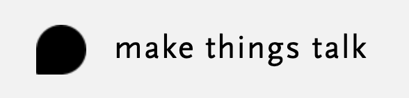

<a href="http://makethingstalk.io"></a>

### a project to build your own rfid trigged mediastation based on a raspberry pi.<br /><br />
    
    

[](https://travis-ci.org/badges/badgerbadgerbadger) [](http://badges.mit-license.org)
<br /><br />


### this project is in early development but we try to provide a working version on master at any time.


## Installation

### Setup RaspberryPI

- Starting on a blank raspian enable SPI via
```shell
$ sudo raspi-config
```
> Select “Interfacing Options” and enable SPI


### Clone

- Clone this repo to your raspberryPI  `https://github.com/hammerlerobi/makethingstalk`

### Setup

Make sure you have at least __node@10 or later__ installed.

## Frontend Part
Navigate in the cloned directory and from there navigate in the `frontend` directory. 

> install dependencies using npm install

```shell
$ npm install 
```

> now build the frontend:

```shell
$ npm run build
```

you should see a build folder now in in the frontend directory.


## Backend Part
Navigate in the cloned directory and from there navigate in the `backend` directory. 

> install dependencies using npm install

```shell
$ npm install 
```


> now you should be good to go run:

```shell
$ npm run start
```

If you run into issues maybe your user has not the correct rights to access the SPI Interface. We will provide a how to for this issue later for now run in elevated shell using sudo.

```shell
$ sudo npm run start
```

Now the application should start and you should be able to navigate to the frontend aswell as the player.

You can find the Player on\
http://localhost:4000/player/

Videos should be played via OMXPlayer make sure you have the latest version installed


You can find the Backend on\
http://localhost:4000/

---


## License

[](http://badges.mit-license.org)

- **[MIT license](http://opensource.org/licenses/mit-license.php)**
- Copyright 2020 © <a href="https://makethingstalk.io" target="_blank">The guys from makethingstalk</a>.
